# Orbis Research — Territory Polygons

This repository documents the research and prototyping behind Orbis's **territory system** — the algorithm that turns a scattered set of places (circles on a map) into the smooth, amorphous **polygons** that represent a tribe's claimed ground.

Everything below is the research itself, laid out in order, so you can read the full method — with diagrams, explanations, and code — without opening a single folder. Each example is also runnable: open its `index.html` with a live server and drag the circles around.

> **Play with the research live: [orbis.social/r/research](https://orbis.social/r/research/)** — the full v2 simulation in your browser: place claims for four tribes, run automatic check-ins, and watch territories fuse, collide, and decay.

<a href="https://orbis.social/r/research/">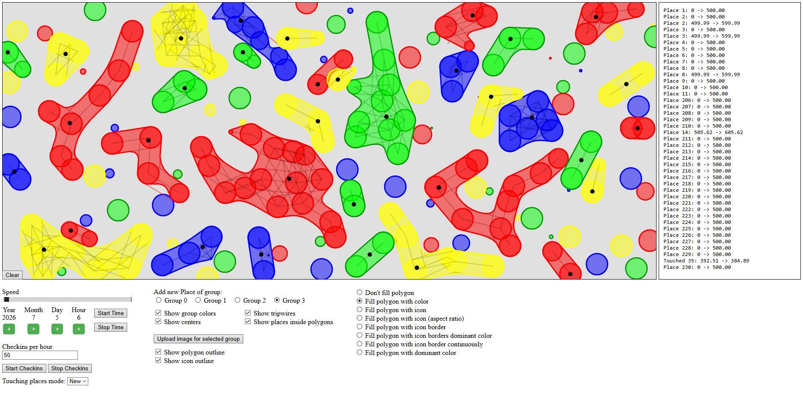</a>

## The goal

Orbis started by drawing each place as an individual circle. The goal of this research was to evolve that into **connected, organic territory shapes**: when places of the same tribe are close enough, they merge into one continuous polygon.

<p float="left">
  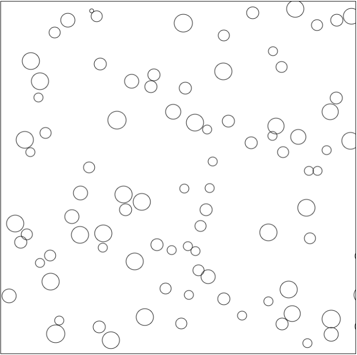
  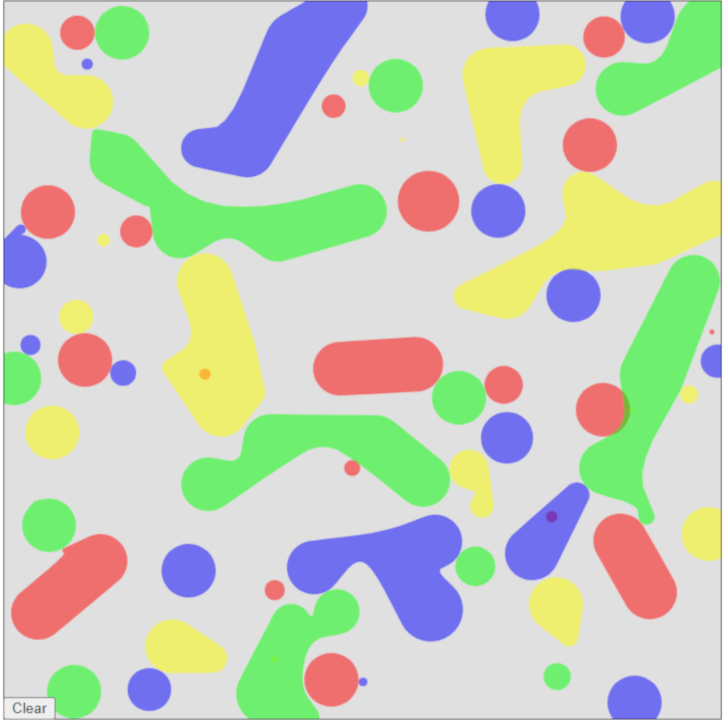
</p>

*Left: the starting point (individual places). Right: the target (amorphous territory shapes).*

The method is built in two stages:

1. **[Fundamentals of Tripwires](#part-1--fundamentals-of-tripwires)** — how to decide *whether* two places connect.
2. **[Building the Polygons](#part-2--building-the-polygons)** — how to turn those connections into a smooth bounding shape.

A reference for every geometry function is in **[Function Documentation](#function-documentation)**.

---

## Part 1 — Fundamentals of Tripwires

A **tripwire** is a line between two places. Three tripwires connect any pair of circles: one straight line between the two centers, and two outer tangent lines. Tripwires determine whether a connection exists and whether it should break.

### 1.1 · Tripwires between two circles

The three tripwires between two circles. The center tripwire is a straight line between centers; the two outer ones come from `calculateExternalTangents`, which returns the four tangency points (connect `p1a→p2a` and `p1b→p2b`).


```javascript
export function calculateExternalTangents(x1, y1, r1, x2, y2, r2) {
  var dx = x2 - x1, dy = y2 - y1;
  var d = Math.sqrt(dx * dx + dy * dy);
  var angleBetweenCenters = Math.atan2(dy, dx);
  var angleToTangent = Math.acos((r1 - r2) / d);

  var angle1 = angleBetweenCenters + angleToTangent;
  var angle2 = angleBetweenCenters - angleToTangent;

  var p1a = { x: x1 + r1 * Math.cos(angle1), y: y1 + r1 * Math.sin(angle1) };
  var p2a = { x: x2 + r2 * Math.cos(angle1), y: y2 + r2 * Math.sin(angle1) };
  var p1b = { x: x1 + r1 * Math.cos(angle2), y: y1 + r1 * Math.sin(angle2) };
  var p2b = { x: x2 + r2 * Math.cos(angle2), y: y2 + r2 * Math.sin(angle2) };

  return { p1a, p1b, p2a, p2b };
}
```

### 1.2 · Tripwires break when distance is too large

Two circles connect only when they're close enough. We take the distance between centers, subtract both radii to get the gap between outer borders, and break the connection past a threshold.

<p float="left">
  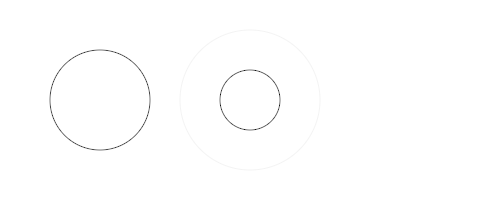
  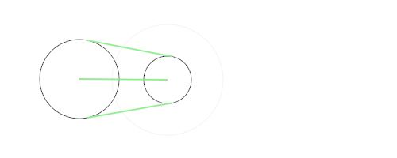
</p>

```javascript
var dx = x2 - x1, dy = y2 - y1;
var d = Math.sqrt(dx * dx + dy * dy);
var distance = d - r1 - r2;

// In the final simulation the threshold is based on the radii themselves:
if (distance < r1 + r2) {
  // connect the circles
}
```

### 1.3 · Tripwires between multiple places

Scaling from two circles to many: iterate over every pair, record which places are close, then build tripwires for each place against its close neighbors.

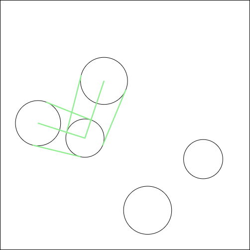

### 1.4 · Tripwires with different groups

Each place belongs to a **group** (a tribe). Places only connect to others in the same group — enforced with a single group check during the distance pass. Same-color places connect; different colors don't.


### 1.5 · Detecting collisions with a different group

A place from another group can intrude on a tripwire. `circleLineCollision` checks a circle against each tripwire's line segment; on a hit, the tripwire turns red.

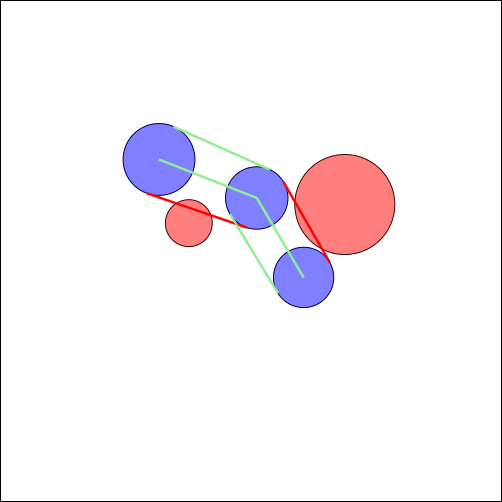

```javascript
export function circleLineCollision(circleX, circleY, radius, lineX1, lineY1, lineX2, lineY2) {
  let closestX = lineX1, closestY = lineY1;
  const lineLength = Math.sqrt((lineX2 - lineX1) ** 2 + (lineY2 - lineY1) ** 2);
  if (lineLength !== 0) {
    const u = ((circleX - lineX1) * (lineX2 - lineX1) + (circleY - lineY1) * (lineY2 - lineY1)) / (lineLength ** 2);
    closestX = lineX1 + u * (lineX2 - lineX1);
    closestY = lineY1 + u * (lineY2 - lineY1);
  }
  const distance = Math.sqrt((circleX - closestX) ** 2 + (circleY - closestY) ** 2);
  return distance <= radius;
}
```

### 1.6 · Two cut tripwires cut the connection

A `TripwireGroup` manages the three tripwires between two places and decides whether the connection still holds. If two tripwires are cut (or, in the final simulation, the middle one), the connection breaks completely.

<p float="left">
  
  
</p>

### 1.7 · Simulation with lots of places

A scale validation — the full connection/breaking logic running across many places to confirm it holds up.

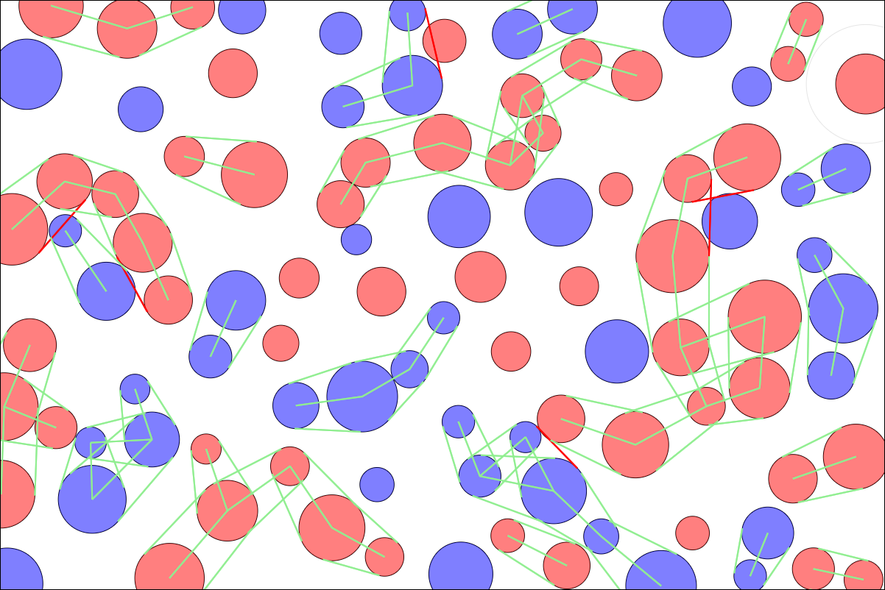

### 1.8 · Tripwires collide with each other

Beyond places intruding on tripwires, two tripwires from different groups can cross each other. We iterate all tripwires and flag crossings as `isColliding` (in the app, only the *older* tripwire changes state).

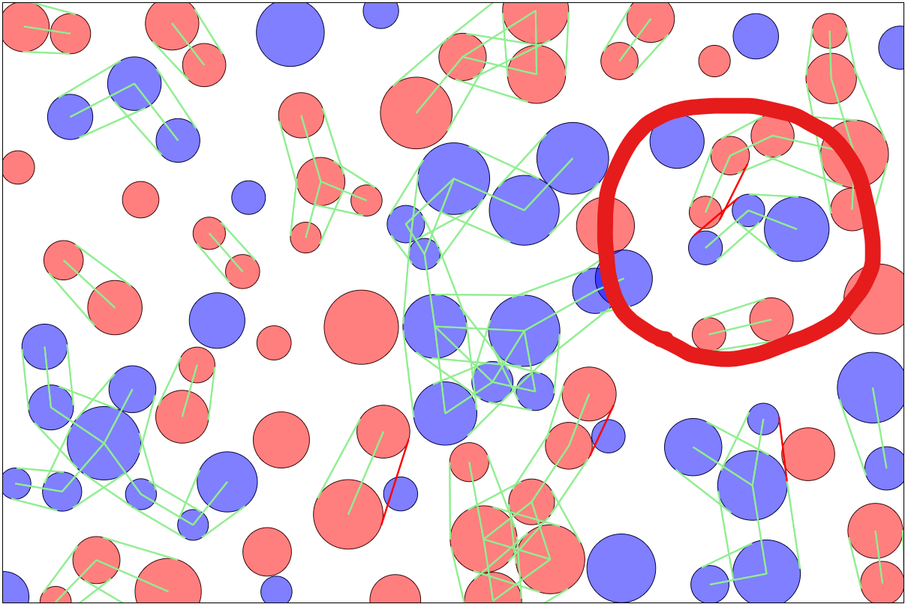

---

## Part 2 — Building the Polygons

With connections decided, the next stage turns them into the actual **bounding shape** around a group of places.

### 2.1 · Calculating inner tangents

To surround places we need polygons, not just lines. When no tripwire is broken we use the **external** tangents; when an outer tripwire breaks we swap in an **internal** tangent. `calculateInternalTangents` computes those inner tangency points.

<p float="left">
  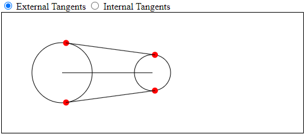
  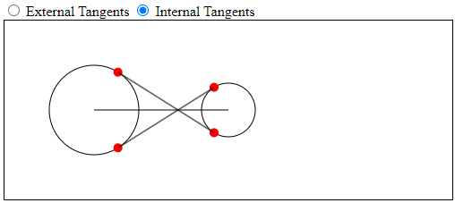
</p>

```javascript
export function calculateInternalTangents(x1, y1, r1, x2, y2, r2) {
  let distCenters = Math.sqrt((x2 - x1) ** 2 + (y2 - y1) ** 2);
  let r3 = r1 + r2;
  let angle = Math.atan2(y2 - y1, x2 - x1);
  let tangentAngle = Math.asin(r3 / distCenters) - Math.PI / 2;

  let t1x = x1 + r1 * Math.cos(angle + tangentAngle), t1y = y1 + r1 * Math.sin(angle + tangentAngle);
  let t2x = x1 + r1 * Math.cos(angle - tangentAngle), t2y = y1 + r1 * Math.sin(angle - tangentAngle);
  let s1x = x2 + r2 * Math.cos(angle + tangentAngle + Math.PI), s1y = y2 + r2 * Math.sin(angle + tangentAngle + Math.PI);
  let s2x = x2 + r2 * Math.cos(angle - tangentAngle + Math.PI), s2y = y2 + r2 * Math.sin(angle - tangentAngle + Math.PI);

  return { p1a: { x: t1x, y: t1y }, p1b: { x: t2x, y: t2y }, p2a: { x: s1x, y: s1y }, p2b: { x: s2x, y: s2y } };
}
```

### 2.2 · Get the bounding polygon

Four polygon variants connect arc points, tangent points, and intersection points depending on which tripwires are intact: **external**, **mixed1**, **mixed2**, and **internal**. Helpers `calculateArcPoints` and `findIntersection` support them. Final smoothing uses the [turf polygon-smooth](https://www.npmjs.com/package/@turf/polygon-smooth/v/6.5.0) library.

<p float="left">
  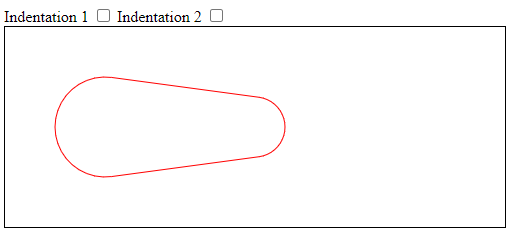
  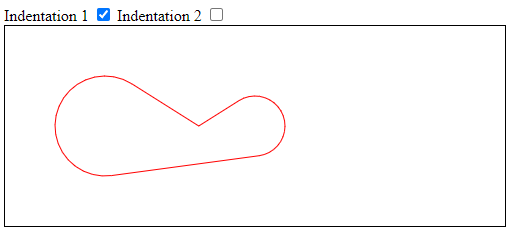
  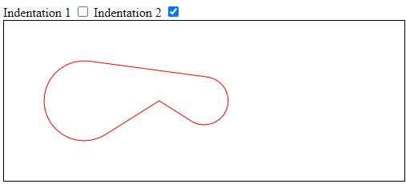
  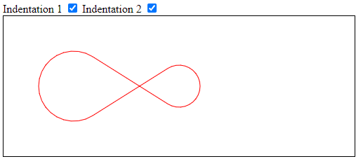
</p>

*External · Mixed1 · Mixed2 · Internal*

### 2.3 · Amorphous shapes with many places

The full result. In `polygon.js`'s `update`: (1) group connected places, (2) union each group's per-place polygons, (3) smooth with turf. The output stores, per group, its member places and the resulting polygon (and later its center point).

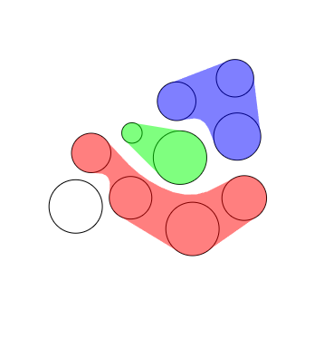

### 2.4 · Calculate the center properly, and account for holes

The final step: give every merged territory a single center point for its map label. A plain **centroid** fails on concave or ring-shaped territories — it can land in a notch or a hole — so we compute the **pole of inaccessibility** with `polylabel`: a grid + priority-queue search for the point deepest inside the polygon (`precision` trades accuracy for speed). When a territory has a hole that contains places, that hole is excluded from the search, so the center never lands in a gap. See [Example 4](./examples/2_Building-the-Polygons/Example_4-Calculate-Center-Properly-And-Account-For-Holes/README.md).

<p float="left">
  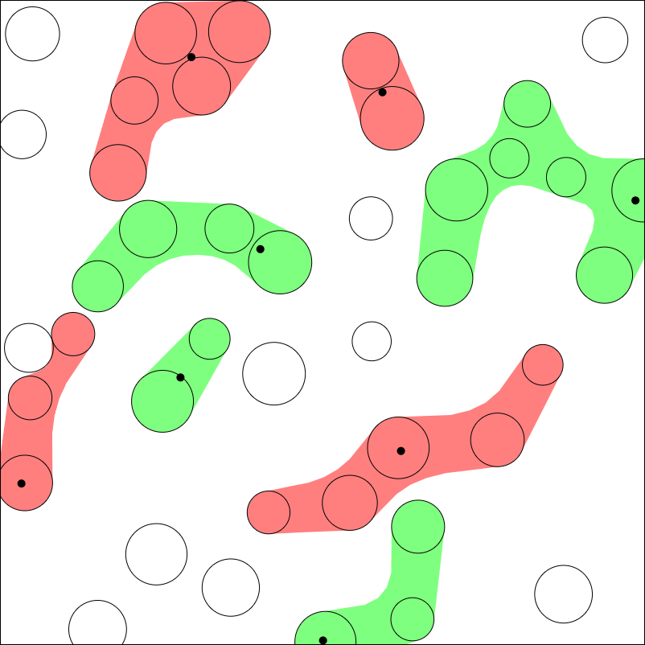
  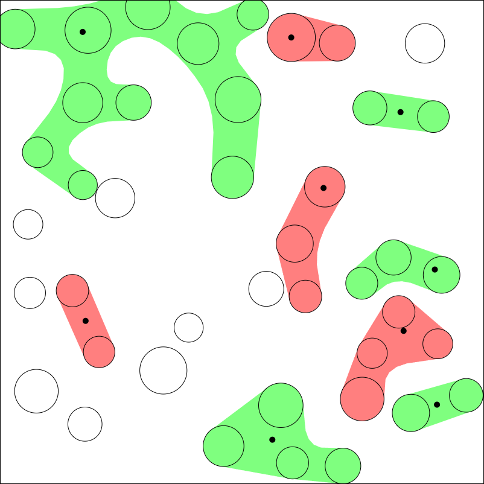
</p>

*Each connected territory gets one center point (black dot), placed deep inside the shape — even for concave territories where a centroid would fall in the gap.*

---

## Function Documentation

Reference for the core geometry functions (`simulation-v2/documentation`).

| Function | What it does |
|---|---|
| `calculateArcPoints` | Points along a circle's arc between two angles (clockwise if `endAngle < startAngle`). |
| `calculateExternalTangents` | External tangent points of two circles — used for the outer tripwires. |
| `calculateInternalTangents` | Internal tangent points — used when an outer tripwire is broken. |
| `findIntersection` | Intersection point of two lines (each defined by two points). |
| `isPointInsidePolygon` | Whether a point lies inside a polygon. |
| `findPolygonCenter` | The polygon's "pole of inaccessibility" (point furthest from the boundary), not the centroid. |
| `createExternalPolygon` | Bounding polygon from external tangents — a rubber band around both circles. |
| `createInternalPolygon` | Bounding polygon from internal tangents and their intersection. |
| `createMixedPolygon1` / `createMixedPolygon2` | Bounding polygons mixing external + internal tangents (differing by which intersection point is used). |

<p float="left">
  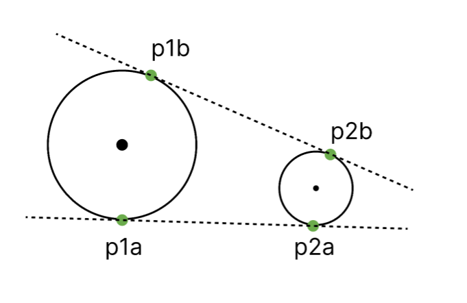
  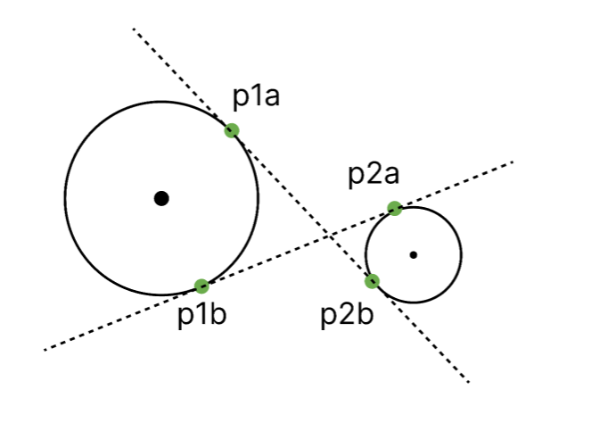
  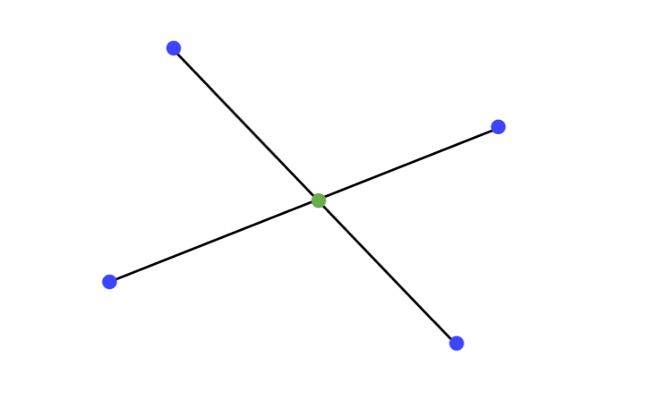
</p>
<p float="left">
  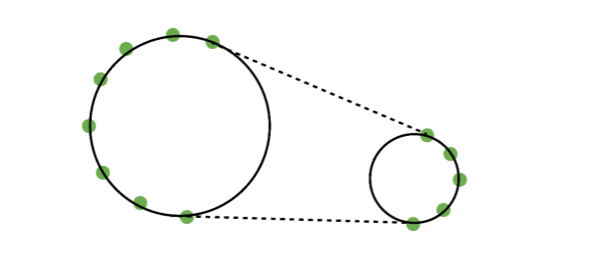
  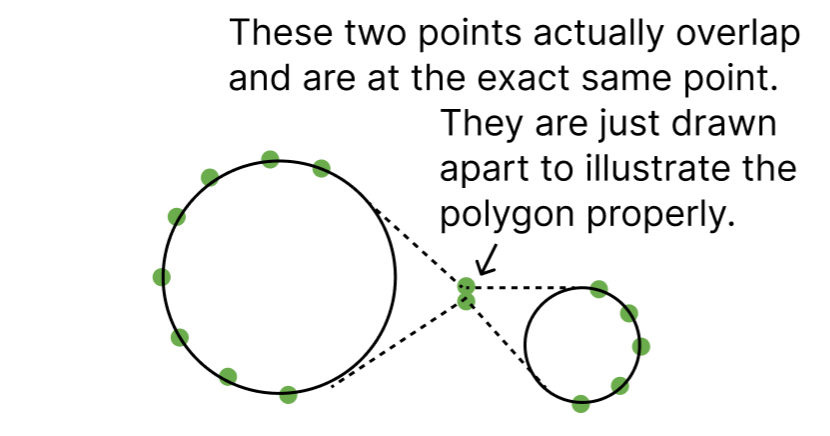
  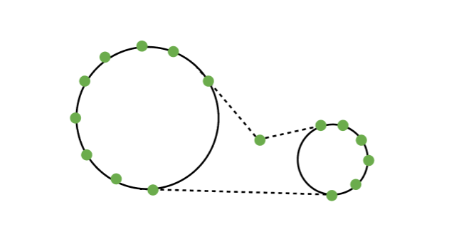
</p>
<p float="left">
  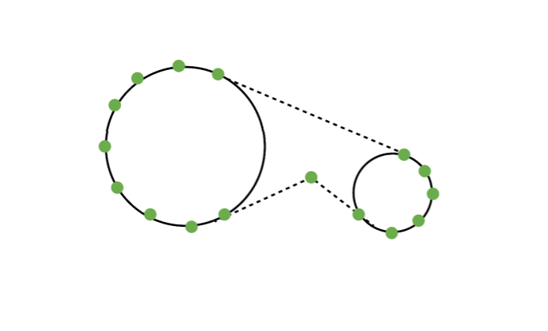
  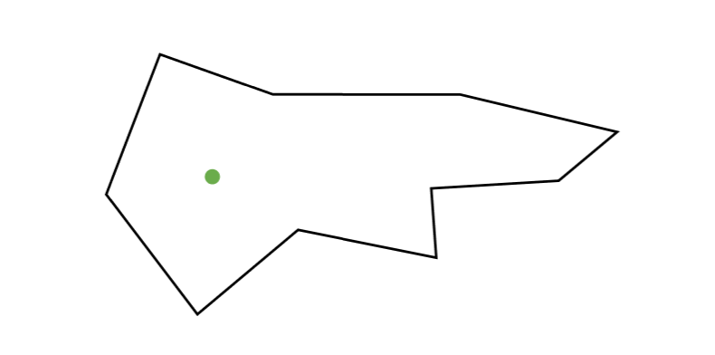
  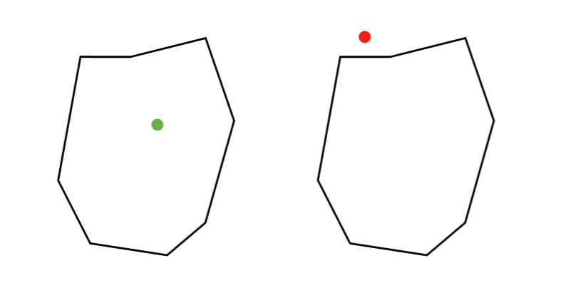
</p>

---

## Repository layout

| Path | Contents |
|---|---|
| `examples/1_Fundamentals-of-Tripwires/` | Part 1 — the 8 tripwire examples, each with its own README, code, and images. |
| `examples/2_Building-the-Polygons/` | Part 2 — the 3 polygon-building examples. |
| `examples/old-examples/` | Earlier exploratory prototypes. |
| `simulation-v2/` | The consolidated v2 simulation (frontend + documented function repo). |

## Running an example

Each example folder is self-contained. Open its `index.html` with any live server (e.g. VS Code's *Live Server*) and drag the circles/places around to see the tripwires, connections, and polygons update in real time. The consolidated v2 simulation is also hosted at [orbis.social/r/research](https://orbis.social/r/research/) — no setup needed.

## License

[AGPL-3.0](./LICENSE).
