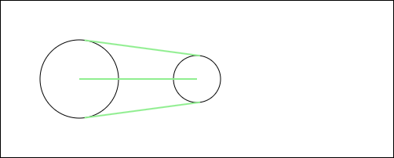

# Tripwires Between Two Circles
If you start the index.html using a live server, you can drag and drop the circles to see how the tripwires change.

## Result


## Description
The method to determine how circles should be connected is based on tripwires. This example shows how those tripwires are calculated and how they are used to connect two circles. Below you can see the three tripwires between two circles.

The tripwire in the center is pretty straightforward. It is a straight line between the two centers of the circles. The other two tripwires are a bit more complex. The function `calculateExternalTangents` calculates the four points necessary to build the two outer tripwires. Connection p1a to p2a and p1b to p2b will result in the two tripwires.

```javascript
export function calculateExternalTangents(x1, y1, r1, x2, y2, r2) {
  // Calculate the distance and angle between centers
  var dx = x2 - x1;
  var dy = y2 - y1;
  var d = Math.sqrt(dx * dx + dy * dy);
  var angleBetweenCenters = Math.atan2(dy, dx);

  // Calculate the angle from the direction line to the tangents
  var angleToTangent = Math.acos((r1 - r2) / d);

  // Correct the angles to find the tangent points for each circle
  var angle1 = angleBetweenCenters + angleToTangent;
  var angle2 = angleBetweenCenters - angleToTangent;

  // Find the points of tangency on both circles
  var p1a = { x: x1 + r1 * Math.cos(angle1), y: y1 + r1 * Math.sin(angle1) };
  var p2a = { x: x2 + r2 * Math.cos(angle1), y: y2 + r2 * Math.sin(angle1) };

  var p1b = { x: x1 + r1 * Math.cos(angle2), y: y1 + r1 * Math.sin(angle2) };
  var p2b = { x: x2 + r2 * Math.cos(angle2), y: y2 + r2 * Math.sin(angle2) };

  return { p1a, p1b, p2a, p2b };
}

```
