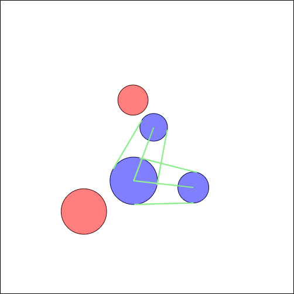

# Tripwires With Different Groups
If you start the index.html using a live server, you can see several places with different radii and colors. You can drag and drop the places to see how the tripwires change. Places with the same color are in the same group and will connect to each other, if they are close enough.

## Result


## Description
This extension is pretty straightforward. Every place gets a group assigned. When we calculate the close places, we only consider places that are in the same group. This is done by adding a check to the distance calculation.

```javascript
// Iterate over every place
for (var i = 0; i < places.length; i++) {
  for (var j = i + 1; j < places.length; j++) {
    // Skip if the places are the same
    if (i === j) {
      continue;
    }

    var place1 = places[i];
    var place2 = places[j];

    // Skip if the places are in different groups
    if (place1.group !== place2.group) {
      continue;
    }

    // Calculate the distance between the places
    var dx = place2.x - place1.x;
    var dy = place2.y - place1.y;
    var d = Math.sqrt(dx * dx + dy * dy);

    var distance = d - place1.r - place2.r;
    if (distance < 1000) {
      place1.closePlaces.push(place2);
    }
  }
}
```
