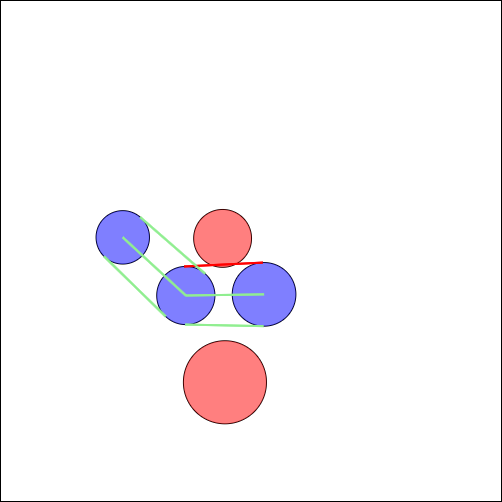
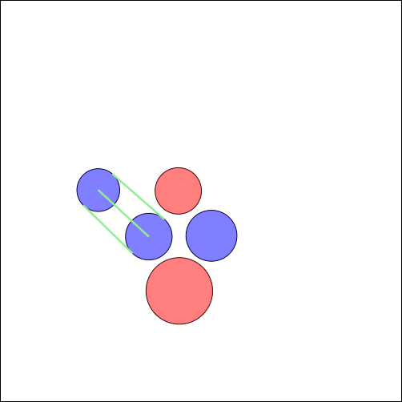

# Two Cut Tripwires Cut the Connection
If you start the index.html using a live server, you can see several places with different radii and colors. You can drag and drop the places to see how the tripwires change. Places with the same color are in the same group and will connect to each other, if they are close enough. If you drag a place of another color into the tripwire of a different group, the tripwire will change its color to red. If two tripwires are cut, the connection between the places will be cut completely.

(In the final simulation, the connection will also count as broken if the middle tripwire is cut.)

## Result

## Description
The main difference to the previous example is the introduction of a tripwire group (./simulation-repo/tripwire-group.js). This group is responsible for managing the three tripwires and checking if the connection between the places is still intact.

Check out the `update` function in the `TripwireGroup` class to see how the connection is checked.
